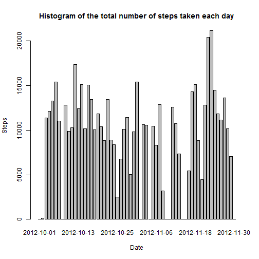

## the knitr document of peer assessment 1 of reproducible research
================================================================

### Part1: Loading and preprocessing the data.
1. Load the data.
2. Process/transform the data (if necessary) into a format suitable for the analysis.

```r
rawData <- read.csv("activity.csv")  # read data
rawData[, 2] <- as.Date(rawData[, 2])  # transform the date into type of Date
head(rawData)
```

```
##   steps       date interval
## 1    NA 2012-10-01        0
## 2    NA 2012-10-01        5
## 3    NA 2012-10-01       10
## 4    NA 2012-10-01       15
## 5    NA 2012-10-01       20
## 6    NA 2012-10-01       25
```

### Part2: the mean total number of steps taken per day.
1. Make a histogram of the total number of steps taken each day.
2. Calculate and report the mean and median total number of steps taken per day.

```r
stepsPerDay <- aggregate(rawData$steps, list(date = rawData$date), sum, na.rm = T)  # the total number of steps taken per day
barplot(stepsPerDay[, 2], names.arg = stepsPerDay[, 1], main = "Histogram of the total number of steps taken each day", 
    xlab = "Date", ylab = "Steps")  # the histogram using barplot() function
```

 

```r
meanSteps <- mean(stepsPerDay[, 2], na.rm = T)  # mean
medianSteps <- median(stepsPerDay[, 2], na.rm = T)  # median
cat("the mean total number of steps is: ", meanSteps)
```

```
## the mean total number of steps is:  9354
```

```r
cat("the median total number of steps is: ", medianSteps)
```

```
## the median total number of steps is:  10395
```

### Part3: the average daily activity pattern.
1. Make a time series plot (i.e. type = "l") of the 5-minute interval (x-axis) and the average number of steps taken, averaged across all days (y-axis).
2. the 5-minute interval, on average across all the days in the dataset, contains the maximum number of steps?

```r
averageSteps <- aggregate(rawData$steps, list(interval = rawData$interval), 
    mean, na.rm = T)  # the average number of steps taken, averaged across all days
plot(averageSteps[, 1], averageSteps[, 2], type = "l", main = "time series plot of 5-minute interval and the number of steps", 
    xlab = "5-minute interval", ylab = "the average number of steps taken")  # time series plot
```

 

```r
maxStepsInterval <- which.max(averageSteps[, 2])  # the index of max steps
cat("the 5-minute interval which contains the maximun number of steps is: interval", 
    averageSteps[maxStepsInterval, 1])  # the 5-minute interval
```

```
## the 5-minute interval which contains the maximun number of steps is: interval 835
```

### Part4: Imputing missing values.
1. Calculate and report the total number of missing values in the dataset (i.e. the total number of rows with NAs).
2. Devise a strategy for filling in all of the missing values in the dataset. The strategy does not need to be sophisticated. For example, you could use the mean/median for that day, or the mean for that 5-minute interval, etc.
3. Create a new dataset that is equal to the original dataset but with the missing data filled in.
4. Make a histogram of the total number of steps taken each day and Calculate and report the mean and median total number of steps taken per day. Do these values differ from the estimates from the first part of the assignment? What is the impact of imputing missing data on the estimates of the total daily number of steps?

```r
missValue <- sum(is.na(rawData[, 1]))  # the total number of missing value
cat("the total number of missing values is: ", missValue)
```

```
## the total number of missing values is:  2304
```

```r
# using the mean of 5-minute interval to fill in the missing values
newData <- rawData
for (intervalIndex in c(1:length(averageSteps[, 1]))) {
    stepsIndex <- is.na(newData[which(newData[, 3] == averageSteps[intervalIndex, 
        1]), 1])  # find the missing values of each interval
    stepsIndex <- which(newData[, 3] == averageSteps[intervalIndex, 1] & is.na(newData[, 
        1]))  # find the missing values of each interval
    newData[stepsIndex, 1] <- averageSteps[intervalIndex, 2]  # fill in the missing values using the mean of the 5-minute interval
}
head(newData)
```

```
##     steps       date interval
## 1 1.71698 2012-10-01        0
## 2 0.33962 2012-10-01        5
## 3 0.13208 2012-10-01       10
## 4 0.15094 2012-10-01       15
## 5 0.07547 2012-10-01       20
## 6 2.09434 2012-10-01       25
```

```r
stepsPerDayNew <- aggregate(newData$steps, list(date = newData$date), sum)  # the total number of steps taken per day
barplot(stepsPerDayNew[, 2], names.arg = stepsPerDayNew[, 1], main = "Histogram of the total number of steps taken each day(New)", 
    xlab = "Date", ylab = "Steps")  # the histogram using barplot() function
```

 

```r
meanStepsNew <- mean(stepsPerDayNew[, 2])  # mean
medianStepsNew <- median(stepsPerDayNew[, 2])  # median
cat("the mean total number of steps is: ", meanStepsNew)
```

```
## the mean total number of steps is:  10766
```

```r
cat("the median total number of steps is: ", medianStepsNew)
```

```
## the median total number of steps is:  10766
```

### Part5: the differences in activity patterns between weekdays and weekends.
1. Create a new factor variable in the dataset with two levels ¨C ¡°weekday¡± and ¡°weekend¡± indicating whether a given date is a weekday or weekend day.
2. Make a panel plot containing a time series plot (i.e. type = "l") of the 5-minute interval (x-axis) and the average number of steps taken, averaged across all weekday days or weekend days (y-axis). The plot should look something like the following, which was creating using simulated data.

```r
weekdaysFactor <- weekdays(newData[, 2])
weekdaysFactor[which(weekdaysFactor == "Saturday" | weekdaysFactor == "Sunday")] <- "weekend"
weekdaysFactor[which(weekdaysFactor == "Monday" | weekdaysFactor == "Tuesday" | 
    weekdaysFactor == "Wednesday" | weekdaysFactor == "Thursday" | weekdaysFactor == 
    "Friday")] <- "weekday"
newData <- cbind(newData, weekdaysFactor)  # combine the weekdays
dataWeekend <- newData[newData$weekdaysFactor == "weekend", ]  # weekend data
dataWeekday <- newData[newData$weekdaysFactor == "weekday", ]  # weekday data
stepsWeekend <- aggregate(dataWeekend[, 1], list(interval = dataWeekend$interval), 
    mean)
stepsWeekday <- aggregate(dataWeekday[, 1], list(interval = dataWeekday$interval), 
    mean)
par(bg = "transparent", mfrow = c(2, 1))  # subplot
plot(stepsWeekend[, 1], stepsWeekend[, 2], type = "l", col = "blue", main = "weekend", 
    xlab = "interval", ylab = "number of steps")  # time series plot weekend
plot(stepsWeekday[, 1], stepsWeekday[, 2], type = "l", col = "blue", main = "weekday", 
    xlab = "interval", ylab = "number of steps")  # time series plot weekday
```

 


### processing R markdown file

```r
library("knitr")
knit2html("PA1_template.Rmd")
```

```
## 
## 
## processing file: PA1_template.Rmd
```

```
## 
  |                                                                       
  |                                                                 |   0%
  |                                                                       
  |.....                                                            |   8%
##   ordinary text without R code
## 
## 
  |                                                                       
  |..........                                                       |  15%
## label: unnamed-chunk-7
## 
  |                                                                       
  |...............                                                  |  23%
##   ordinary text without R code
## 
## 
  |                                                                       
  |....................                                             |  31%
## label: unnamed-chunk-8
```

```
## 
  |                                                                       
  |.........................                                        |  38%
##   ordinary text without R code
## 
## 
  |                                                                       
  |..............................                                   |  46%
## label: unnamed-chunk-9
```

```
## 
  |                                                                       
  |...................................                              |  54%
##   ordinary text without R code
## 
## 
  |                                                                       
  |........................................                         |  62%
## label: unnamed-chunk-10
```

```
## 
  |                                                                       
  |.............................................                    |  69%
##   ordinary text without R code
## 
## 
  |                                                                       
  |..................................................               |  77%
## label: unnamed-chunk-11
```

```
## 
  |                                                                       
  |.......................................................          |  85%
##   ordinary text without R code
## 
## 
  |                                                                       
  |............................................................     |  92%
## label: unnamed-chunk-12
```

```
## 
  |                                                                       
  |.................................................................| 100%
##   ordinary text without R code
```

```
## output file: PA1_template.md
```

 

